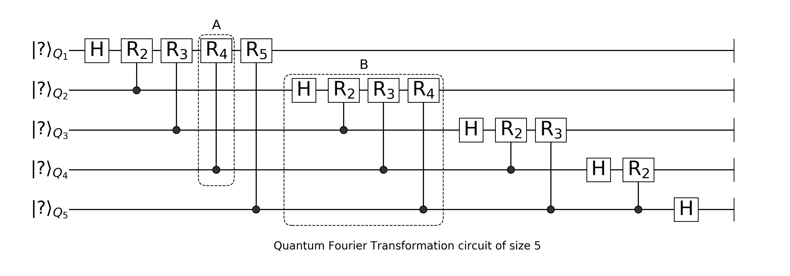
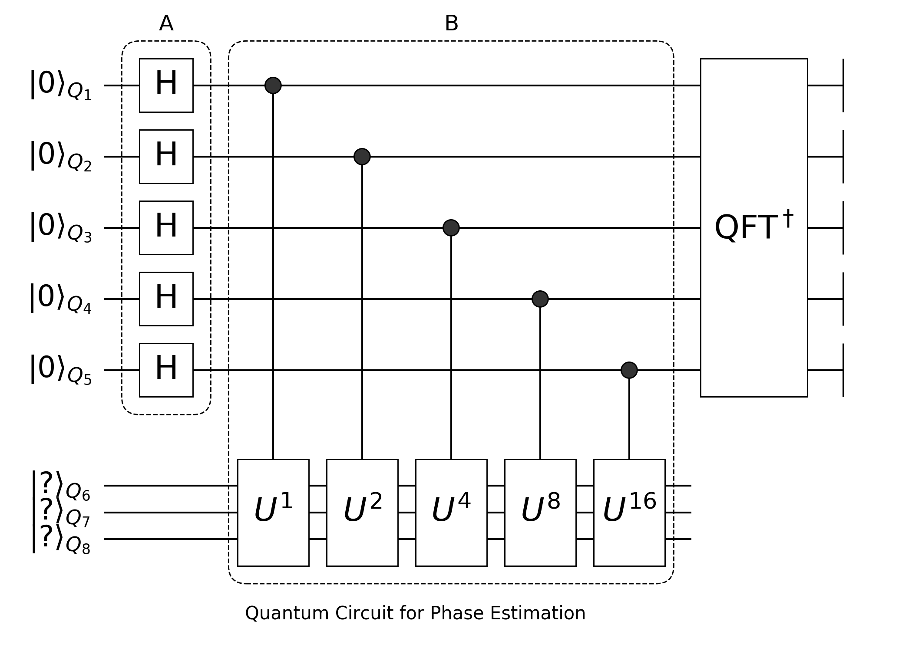

# Quantum Fourier Transformation and Phase Estimation

## Quantum Fourier Transformation


```@example QFT
using Yao

# Control-R(k) gate in block-A
A(i::Int, j::Int, k::Int) = control([i, ], j=>shift(2π/(1<<k)))
# block-B
B(n::Int, i::Int) = chain(i==j ? kron(i=>H) : A(j, i, j-i+1) for j = i:n)
QFT(n::Int) = chain(n, B(n, i) for i = 1:n)

# define QFT and IQFT block.
num_bit = 5
qft = QFT(num_bit)
iqft = qft'   # get the hermitian conjugate
```

The basic building block - controled phase shift gate is defined as

```math
R(k)=\begin{bmatrix}
1 & 0\\
0 & \exp\left(\frac{2\pi i}{2^k}\right)
\end{bmatrix}
```
In Yao, factory methods for blocks will be loaded lazily. For example, if you missed the total
number of qubits of `chain`, then it will return a function that requires an input of an integer.
So the following two statements are equivalent
```@example QFT
control([4, ], 1=>shift(-2π/(1<<4)))(5) == control(5, [4, ], 1=>shift(-2π/(1<<4)))
```
Both of then will return a `ControlBlock` instance. If you missed the total number of qubits. It is OK. Just go on, it will be filled when its possible.

Once you have construct a block, you can inspect its matrix using `mat` function.
Let's construct the circuit in dashed box A, and see the matrix of ``R_4`` gate
```julia
julia> a = A(4, 1, 4)(5)
Total: 5, DataType: Complex{Float64}
control(4)
└─ 1=>Phase Shift Gate:-0.39269908169872414


julia> mat(a.block)
2×2 Diagonal{Complex{Float64}}:
 1.0+0.0im          ⋅         
     ⋅      0.92388-0.382683im
```

Similarly, you can use `put` and `chain` to construct `PutBlock` (basic placement of a single gate) and `ChainBlock` (sequential application of `MatrixBlock`s) instances. `Yao.jl` view every component in a circuit as an `AbstractBlock`, these blocks can be integrated to perform higher level functionality.

You can check the result using classical `fft`
```@example QFT
# if you're using lastest julia, you need to add the fft package.
using FFTW: fft, ifft
using LinearAlgebra: I
using Test

@test chain(num_bit, qft, iqft) |> mat ≈ I

# define a register and get its vector representation
reg = rand_state(num_bit)
rv = reg |> statevec |> copy

# test fft
reg_qft = apply!(copy(reg) |>invorder!, qft)
kv = ifft(rv)*sqrt(length(rv))
@test reg_qft |> statevec ≈ kv

# test ifft
reg_iqft = apply!(copy(reg), iqft)
kv = fft(rv)/sqrt(length(rv))
@test reg_iqft |> statevec ≈ kv |> invorder
```

QFT and IQFT are different from FFT and IFFT in three ways,

1. they are different by a factor of ``\sqrt{2^n}`` with ``n`` the number of qubits.
2. the little end and big end will exchange after applying QFT or IQFT.
3. due to the convention, QFT is more related to IFFT rather than FFT.


## Phase Estimation
Since we have QFT and IQFT blocks we can then use them to realize phase estimation circuit, what we want to realize is the following circuit


In the following simulation, we use equivalent `QFTBlock` in the Yao.`Zoo` module rather than the above chain block,
it is faster than the above construction because it hides all the simulation details (yes, we are cheating :D) and get the equivalent output.

```@example QFT
using Yao
using Yao.Blocks
using Yao.Intrinsics

function phase_estimation(reg1::DefaultRegister, reg2::DefaultRegister, U::GeneralMatrixGate{N}, nshot::Int=1) where {N}
    M = nqubits(reg1)
    iqft = QFT(M) |> adjoint
    HGates = rollrepeat(M, H)

    control_circuit = chain(M+N)
    for i = 1:M
        push!(control_circuit, control(M+N, (i,), (M+1:M+N...,)=>U))
        if i != M
            U = matrixgate(mat(U) * mat(U))
        end
    end

    # calculation
    # step1 apply hadamard gates.
    apply!(reg1, HGates)
    # join two registers
    reg = join(reg1, reg2)
    # using iqft to read out the phase
    apply!(reg, sequence(control_circuit, focus(1:M...), iqft))
    # measure the register (on focused bits), if the phase can be exactly represented by M qubits, only a single shot is needed.
    res = measure(reg; nshot=nshot)
    # inverse the bits in result due to the exchange of big and little ends, so that we can get the correct phase.
    breflect.(M, res)./(1<<M), reg
end
```
Here, `reg1` (``Q_{1-5}``) is used as the output space to store phase ϕ, and `reg2` (``Q_{6-8}``) is the input state which corresponds to an eigenvector of oracle matrix `U`.
The algorithm detials can be found [here](https://en.wikipedia.org/wiki/Quantum_phase_estimation_algorithm).

In this function, `HGates` corresponds to circuit block in dashed box `A`, `control_circuit` corresponds to block in dashed box `B`.
`matrixgate` is a factory function for `GeneralMatrixGate`.

Here, the only difficult concept is `focus`, `focus` returns a `FunctionBlock`, that will make focused bits the active bits.
An operator sees only active bits, and operating active space is more efficient, most importantly, it becomes much easier to integrate blocks.
However, it has the potential ability to change line orders, for safety consideration, you may also need safer [`Concentrator`](@ref).

```@example QFT
r = rand_state(6)
apply!(r, focus(4,1,2))  # or equivalently using focus!(r, [4,1,2])
nactive(r)
```

Then we will have a check to above function

```@example QFT
using LinearAlgebra: qr, Diagonal
rand_unitary(N::Int) = qr(randn(N, N)).Q

M = 5
N = 3

# prepair oracle matrix U
V = rand_unitary(1<<N)
phases = rand(1<<N)
ϕ = Int(0b11101)/(1<<M)
phases[3] = ϕ  # set the phase of the 3rd eigenstate manually.
signs = exp.(2pi*im.*phases)
U = V*Diagonal(signs)*V'  # notice U is unitary

# the state with phase ϕ
psi = U[:,3]

res, reg = phase_estimation(zero_state(M), register(psi), GeneralMatrixGate(U))
println("Phase is 2π * $(res[]), the exact value is 2π * $ϕ")
```
